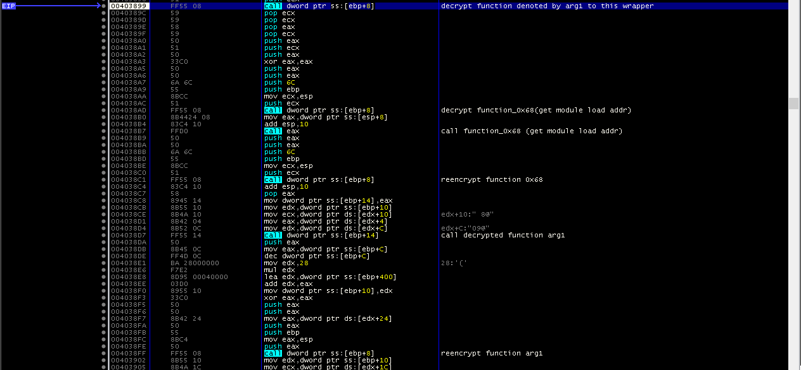
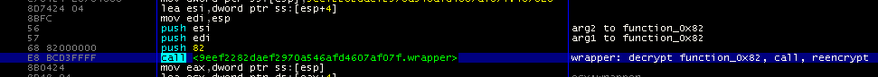

# Summary
I recently observed a suspected Fin7 JSSLoader sample packed with a previously unseen crypter. Interestingly, unlike most crypters which decrypt or extract an entire embedded payload at once, this crypter actually on the fly decrypts each function, calls it, then reencrypts it so that there is never a complete payload sitting in memory that can be dumped. 

Attack flow:
    Quickbooks themed phish with link -> WSF (WINGKNIGHT) downloader -> Crypted JSSLoader/BIRDWATCH

After unpacking, the JSSLoader malware itself seems largely unchanged from recent reporting:
- https://www.proofpoint.com/us/blog/threat-insight/jssloader-recoded-and-reloaded
- https://www.mandiant.com/resources/evolution-of-fin7

# Initialization
The Crypter starts off by parsing an array of encrypted function lengths that are located relative to EIP. By starting with a hardcoded addresss for the first function, it keeps adding these lengths in order to calculate the address of the next encrypted function. This list of function pointes is saved and referenced later by the wrapper function.

It then xor decrypts the "wrapper" function. All further function calls are performed using this wrapper function, which accepts a function number, decrypts it, calls it, then reencrypts it:



# Wrapper Function
All functions are decrypted with the same xor key. I only have two samples to base this on so far, but the key seems to always be located 0x152 bytes after the last function. 

All further calls in the program are made through the wrapper function. They look like this: 

Where 0x82 is the index into the array of encrypted function pointers and the other two args are arguments passed onto that function after it is decrypted. 

# Encrypted Strings
The string decryption function in shown and annoted below. strings are accessed similarly to the functions with a function `get_string(*decrypted_string, index)` which will decrypt the appropriate string and copy it to the supplied buffer.

To decrypt, every pair of characters are swapped, then 1 is added the first and 1 is subtracted from the second. If the string length is odd, the last character has 2 subtracted from it.
Decryption is easier to understand with a quick example:
    `BCDEF` => `DAFCD`

```
00405F70 | 53                       | push ebx                                |
00405F71 | 8B4C24 0C                | mov ecx,dword ptr ss:[esp+C]            |
00405F75 | 8B5424 08                | mov edx,dword ptr ss:[esp+8]            |
00405F79 | 8A1A                     | mov bl,byte ptr ds:[edx]                | bl = ciphertext[i]
00405F7B | 84DB                     | test bl,bl                              |
00405F7D | 8BC1                     | mov eax,ecx                             | ecx:"tV`132e-mk"
00405F7F | 74 25                    | je bw4.405FA6                           |
00405F81 | 8BC1                     | mov eax,ecx                             | ecx:"tV`132e-mk"
00405F83 | 8A7A 01                  | mov bh,byte ptr ds:[edx+1]              | bh = ciphertext[i+1]
00405F86 | 84FF                     | test bh,bh                              |
00405F88 | 74 0D                    | je bw4.405F97                           |
00405F8A | FEC7                     | inc bh                                  |
00405F8C | 8838                     | mov byte ptr ds:[eax],bh                | plaintext[i] = ciphertext[i+1] + 1
00405F8E | 40                       | inc eax                                 |
00405F8F | 0FB61A                   | movzx ebx,byte ptr ds:[edx]             |
00405F92 | 42                       | inc edx                                 |
00405F93 | FECB                     | dec bl                                  |
00405F95 | EB 03                    | jmp bw4.405F9A                          |
00405F97 | 80C3 FE                  | add bl,FE                               | if len(ciphertext)%2 !=  0: ciphertext[-1] -= 2
00405F9A | 8818                     | mov byte ptr ds:[eax],bl                | plaintext[i+1] = ciphertext[i] - 1
00405F9C | 40                       | inc eax                                 |
00405F9D | 0FB65A 01                | movzx ebx,byte ptr ds:[edx+1]           |
00405FA1 | 42                       | inc edx                                 |
00405FA2 | 84DB                     | test bl,bl                              |
00405FA4 | 75 DD                    | jne bw4.405F83                          |
00405FA6 | C600 00                  | mov byte ptr ds:[eax],0                 |
00405FA9 | 2BC1                     | sub eax,ecx                             | ecx:"tV`132e-mk"
00405FAB | 5B                       | pop ebx                                 |
00405FAC | C3                       | ret                                     |
```

<details><summary>Strings</summary>

|Index|Encrypted String|Decrypted String|
|---|---|---|
|01| bqoh| rain|
|02| beohv| faint|
|03| irs`m| shark|
|04| jgsds`ib{| hierarchy|
|05| sattj| brush|
|06| sfnhd`g| grimace|
|07| fqpbof{hg| recognize|
|08| plotbsoh| mountain|
|09| mod`g| place|
|0A| sotdvrfq| pressure|
|0B| fcbk{| delay|
|0C| puvkumfdt| volunteer|
|0D| ors`n| snarl|
|0E| irn`g| shame|
|0F| u`jsvsfc| attitude|
|10| pomn| pool|
|11| sophjqzs| priority|
|12| ord`m| snack|
|13| bbfspfzq| category|
|14| zl| my|
|15| fmlbbkfb| necklace|
|16| fcpbbqjsfu| decorative|
|17| psfvt| tower|
|18| peotbsoh| fountain|
|19| pruebvfq| software|
|1A| jrhdg| siege|
|1B| sse`g| trade|
|1C| sfw`md| gravel|
|1D| fajfomohi| beginning|
|1E| seh`bqum| fragrant|
|1F| ydddutg| execute|
|20| snisenyn| orthodox|
|21| bgnqven| harmful|
|22| mbt`srpno| classroom|
|23| tnssd`{hg| ostracize|
|24| mae`g| blade|
|25| zgoounjgfy| hypnothize|
|26| fffmbqn| general|
|27| d`jgwdg| achieve|
|28| poudzq| poetry|
|29| odvrfq| ensure|
|2A| sothon| prison|
|2B| jeem| find|
|2C| sowdodv| prevent|
|2D| ydssd`v| extract|
|2E| sotdehodjsm`| presidential|
|2F| sfe`btfs| graduate|
|30| prutj| south|
|31| fvld| week|
|32| 0.;dtisbqh!s| //e:jscript |
|33| -!v!fr#q#9| ","user":"|
|34| jV4m`1sOdntdprt| Win32_Processor|
|35| POUR| POST|
|36| fxu| yes|
|37| u%qx>dc| &type=a|
|38| *&| ')|
|39| PRUEBVFQN[dhpqprueO[UDGbqflpvlqTudqtO[QC| SOFTWARE\Microsoft\NET Framework Setup\NDP|
|3A| PQUND[NH3U| ROOT\CIMV2|
|3B| bBibTderpRuebvfq| CacheSsdSoftware|
|3C| #+gNjefbfU#q#9| ,"OfficeVer":"|
|3D| -!e!nnj`#m#9| ","domain":"|
|3E| FRFKUB+GPQ!L| SELECT * FROM |
|3F| 0.;dcudrjquo"| //e:vbscript |
|40| pVeq| Word|
|41| k-u| .js|
|42| fFIstnOsn`Xd| GetHostNameW|
|43| -!t!txohpe;!}| ","sysinfo":{|
|44| yDfbn| Excel|
|45| s`otgj`fkf| arun failed|
|46| -!q!eh;!$| ","pid":"|
|47| PVLQSFVNR| WORKGROUP|
|48| vNmspnm| Outlook|
|49| m$w| %lu|
|4A| d.unhpdut6'!%fc!kg."| /c timeout 5 && del /f |
|4B| jV4m`1pBqlutsdzRurnd| Win32_ComputerSystem|
|4C| v$| %u|
|4D| vbmq8.8-/72| curl/7.78.0|
|4F| -!#jrfy;!$| ", "size":"|
|51| oTojxn!mpbnlo`f| Unknown command|
|52| tTsdpCbloh| UserDomain|
|53| -\b!jcgm#n|9q!s``sgne^nnj`#m#9| ],"adinfo":{"part_of_domain":"|
|54| >qv$| r=%u|
|55| #zbmfl;!$| {"name":"|
|56| w-ta| .vbs|
|57| Q!pqfbtrsn+)#)#9$| "Processor\*\*\*":""|
|58| tbsbqh/sydg| cscript.exe|
|59| PRUEBVFQN[dhpqprueP[gedhg| SOFTWARE\Microsoft\Office|
|5A| PRUEBVFQN[dhpqprueX[ohpctvD[stfqumfUtqph]mvQp| SOFTWARE\Microsoft\Windows\CurrentVersion\Run|
|5B| #+| ,"|
|5C| pV7v6| Wow64|
|5D| -| ,|
|5E| D.qxnsdirmd!k$| /C powershell "|
|5F| pBqlutsdbMfl| ComputerName|
|60| ffdsel!kbemhed| getcmdl failed|
|61| tV`132e-mk| Ws2_32.dll|
|62| nb/cydg| cmd.exe|
|63| D!nnvofsTqtxfs-lbq+l+);!#!| "ComputerSystem,ram\*\*\*":""|
|65| @.eh?| /?id=|
|66| e-mk| .dll|
|67| c#en!x!<JZ/NjEfk;\S9bdBcmkfSuw('| $body = [IO.File]::ReadAllText('|
|68| -\e!tdujqng^mh`djkur;!]| ],"desktop_file_list":[|
|69| #+fMGsbqflpvlq#r#9| ,"NetFrameworks":"|
|6A| ~!| "}}|
|6B| PRUEBVFQX[xn5532pMfcN[dhpqprueP[gedhg| SOFTWARE\Wow6432Node\Microsoft\Office|
|6C| ;!$| ":"|
|6D| RVN| WQL|
|6E| prutfgoqurpqhmmbunjghmd-nn| southernstrongclothing.com|
|6F| f-fw| .exe|
|70| -|q!pqfbtrtd;!]| },"processes":[|
|71| #zjefk;!$| {"file":"|
|72| #zpgur;!$| {"host":"|
|73| fv&\<w| we=%u|
|74| pm| no|
|75| jV4m`1qNsdu`ohTftxfso| Win32_OperatingSystem|
|76| P!fobqjshmzRurnd+)#)#9$| "OperatingSystem\*\*\*":""|
|77| ~!| "}|
|78| u-uw| .txt|
|79| d.sotmc4k/1yd!d| /c rundll32.exe |
|7A| +[| \*|
|7B| QHMGBOJOE-MK| IPHLPAPI.DLL|
|7C| IRMD4K/1mcn| SHELL32.dll|
|7D| ummc/kmcn| ntdll.dll|
|7E| FJOQMD32e-mk| KERNEL32.dll|
|7F| mn4d/1mcn| ole32.dll|
|80| MNBDUT32e-mk| OLEAUT32.dll|
|81| JVJMFM/Smcn| WININET.dll|
|82| TTSD32e-mk| USER32.dll|
|83| E@BUJO32e-mk| ADVAPI32.dll|
</details>

# Script
I wrote a  to parse out the encrypted functions, decrypt them, and replace calls to the wrapper function with calls directly to the decrypted functions to simplify analysis.

It will also identify the "encrypted" strings, decrypt them and dump those out. Those strings are accessed similarly to the functions with a function `get_string(*decrypted_string, index)` which will decrypt the appropriate string and copy it to the supplied buffer. 

I'd eventually like to unpack those strings and replace references to `get_string` with direct references to the decrypted strings, but it is more difficult than the function replacements and I don't have it working  yet. 

Usage:
```
python3 ~/tools/Unpackers-and-Config-Extractors/jssloader/unpack.py ~/RE/samples/fin7/2022-05-26/9eef2282daef2970a546afd4607af07f.exe -h
usage: unpack.py [-h] [-v] [-o OUT] [-s] files [files ...]

unpack.py [OPTION]... [FILES]...

positional arguments:
  files

optional arguments:
  -h, --help         show this help message and exit
  -v, --verbose      Increase verbosity. Can specify multiple times for more verbose output
  -o OUT, --out OUT  Path to dump unpacked file to
  -s, --strings      print decrypted strings
```
Example output:
```
python3 ~/tools/Unpackers-and-Config-Extractors/jssloader/unpack.py ~/RE/samples/fin7/2022-05-26/9eef2282daef2970a546afd4607af07f.exe  -vv -s
2022-06-06 16:01:54,068 - JSSLoader Unpacker - INFO     Processing /Users/jhumble/RE/samples/fin7/2022-05-26/9eef2282daef2970a546afd4607af07f.exe
2022-06-06 16:01:54,094 - JSSLoader Unpacker - INFO     Removing xor function 0x00404E20 from set of functions to decrypt (already decrypted at start)
2022-06-06 16:01:54,094 - JSSLoader Unpacker - INFO     Found call to main. function offset: 0x68 addr: 0x00406440
2022-06-06 16:01:54,094 - JSSLoader Unpacker - INFO     main patch: before: b'8bc48928c740043000000050ffd18b4c240889690a83c4106a68ffd1' after: b'e8b55200009090909090909090909090909090909090909090909090'
2022-06-06 16:01:54,094 - JSSLoader Unpacker - INFO     xor passphrase: b'6558076622fdd7d9353f4a294aa5e01e6ebcfc21f10fa1244fddefb592e019'
2022-06-06 16:01:54,102 - JSSLoader Unpacker - INFO     Found decryption function 0x00403820
2022-06-06 16:01:54,117 - JSSLoader Unpacker - INFO     Found encrypted string array at 0x00407A51
Strings:
Index    Decrypted String
01        bqoh                                                         rain
02        beohv                                                        faint
...
```

# Samples
Crypted samples:
- [91ae7d316b081acf783a2127b5611c17](https://www.virustotal.com/gui/file/f21a5d973c166a38115be2355ef66ed364718545a3194b65a457921c782fdffd)  (C2: rodericwalter.com) 
    - [Unpacked copy produced by my script](https://www.virustotal.com/gui/file/461e69fb952c7f83a2b73c2c27b6b4cce41bf438966ce7447a140c8675f2c319)
- 9eef2282daef2970a546afd4607af07f (C2: 1southernstrongclothing[.]com)

# YARA Detection
```
import "pe"
rule Classification_Fin7_JSSLoader_Crypter: BIRDWATCH JSSLoader Fin7 {
    meta:
        tlp = "amber"
        author = "Jared Anderson, Jeremy Humble"
        date = "2022-05-31"
        description = "JSSLoader"
        aliases = "BIRDWATCH,JSSLoader"
        hashes = "1da6525ae1ef83b6f1dc02396ef0933732f9ffdfca0fda9b2478d32a54e3069b"

    strings:
        /*
            00404E55 | 47                       | inc edi                                 |
            00404E56 | 83FE 1E                  | cmp esi,1E                              |
            00404E59 | 7F 13                    | jg 9eef2282daef2970a546afd4607af07f.404 |
            00404E5B | 51                       | push ecx                                |
            00404E5C | 50                       | push eax                                |
            00404E5D | 8A0430                   | mov al,byte ptr ds:[eax+esi]            |
            00404E60 | 8A21                     | mov ah,byte ptr ds:[ecx]                |
            00404E62 | 03F7                     | add esi,edi                             |
            00404E64 | 32C4                     | xor al,ah                               |
            00404E66 | 8801                     | mov byte ptr ds:[ecx],al                |
            00404E68 | 58                       | pop eax                                 |
            00404E69 | 59                       | pop ecx                                 |
            00404E6A | 03CF                     | add ecx,edi                             |
            00404E6C | EB 02                    | jmp 9eef2282daef2970a546afd4607af07f.40 |
            00404E6E | 33F6                     | xor esi,esi                             |
            00404E70 | 3BCA                     | cmp ecx,edx                             |
            00404E72 | 72 E2                    | jb 9eef2282daef2970a546afd4607af07f.404 |
        */

        // Split up by register so we have at least 2 hard bytes at the start to prevent yara from complaining about performance
        $decrypt_eax =  {
                            83 F8 ??                        [0-12]
                            (E9|EB|7F|0F) ??                [0-12]
                            (50|51|52|53|55|56|57)          [0-12]
                            (50|51|52|53|55|56|57)          [0-12]
                            8A ?? ??                        [0-12]
                            8A ??                           [0-12]
                            03 (F0|F1|F2|F3|F5|F6|F7)       [0-12]
                            32 (C1|C2|C3|C4|C5|C6|C7|C8)    [0-12]
                            88 (01|09|11|19|29|31|39) 
                        }

        $decrypt_ecx =  {
                            83 F9 ??                        [0-12]
                            (E9|EB|7F|0F) ??                [0-12]
                            (50|51|52|53|55|56|57)          [0-12]
                            (50|51|52|53|55|56|57)          [0-12]
                            8A ?? ??                        [0-12]
                            8A ??                           [0-12]
                            03 (F0|F1|F2|F3|F5|F6|F7)       [0-12]
                            32 (C1|C2|C3|C4|C5|C6|C7|C8)    [0-12]
                            88 (01|09|11|19|29|31|39) 
                        }

        $decrypt_edx =  {
                            83 FA ??                        [0-12]
                            (E9|EB|7F|0F) ??                [0-12]
                            (50|51|52|53|55|56|57)          [0-12]
                            (50|51|52|53|55|56|57)          [0-12]
                            8A ?? ??                        [0-12]
                            8A ??                           [0-12]
                            03 (F0|F1|F2|F3|F5|F6|F7)       [0-12]
                            32 (C1|C2|C3|C4|C5|C6|C7|C8)    [0-12]
                            88 (01|09|11|19|29|31|39) 
                        }
        $decrypt_ebx =  {
                            83 FB ??                        [0-12]
                            (E9|EB|7F|0F) ??                [0-12]
                            (50|51|52|53|55|56|57)          [0-12]
                            (50|51|52|53|55|56|57)          [0-12]
                            8A ?? ??                        [0-12]
                            8A ??                           [0-12]
                            03 (F0|F1|F2|F3|F5|F6|F7)       [0-12]
                            32 (C1|C2|C3|C4|C5|C6|C7|C8)    [0-12]
                            88 (01|09|11|19|29|31|39) 
                        }

        $decrypt_ebp =  {
                            83 FD ??                        [0-12]
                            (E9|EB|7F|0F) ??                [0-12]
                            (50|51|52|53|55|56|57)          [0-12]
                            (50|51|52|53|55|56|57)          [0-12]
                            8A ?? ??                        [0-12]
                            8A ??                           [0-12]
                            03 (F0|F1|F2|F3|F5|F6|F7)       [0-12]
                            32 (C1|C2|C3|C4|C5|C6|C7|C8)    [0-12]
                            88 (01|09|11|19|29|31|39) 
                        }

        $decrypt_esi =  {
                            83 FE ??                        [0-12]
                            (E9|EB|7F|0F) ??                [0-12]
                            (50|51|52|53|55|56|57)          [0-12]
                            (50|51|52|53|55|56|57)          [0-12]
                            8A ?? ??                        [0-12]
                            8A ??                           [0-12]
                            03 (F0|F1|F2|F3|F5|F6|F7)       [0-12]
                            32 (C1|C2|C3|C4|C5|C6|C7|C8)    [0-12]
                            88 (01|09|11|19|29|31|39) 
                        }

        /*$decrypt_edi =  {
                            83 FF ??                        [0-12]
                            (E9|EB|7F|0F) ??                [0-12]
                            (50|51|52|53|55|56|57)          [0-12]
                            (50|51|52|53|55|56|57)          [0-12]
                            8A ?? ??                        [0-12]
                            8A ??                           [0-12]
                            03 (F0|F1|F2|F3|F5|F6|F7)       [0-12]
                            32 (C1|C2|C3|C4|C5|C6|C7|C8)    [0-12]
                            88 (01|09|11|19|29|31|39) 
                        }*/


    /*
        00401124 | 5F                       | pop edi                                              | edi:EntryPoint
        00401125 | 8947 FC                  | mov dword ptr ds:[edi-4],eax                         |
        00401128 | 8947 F8                  | mov dword ptr ds:[edi-8],eax                         |
        0040112B | 50                       | push eax                                             |
        0040112C | E2 FD                    | loop birdwatch.40112B                                |
        0040112E | 57                       | push edi                                             | edi:EntryPoint
    */
    $clear_stack = {    5?              
                        89 4? FC 
                        89 4? F8
                        5?
                        E2 FD
                        5?
                    }
    /*
        00401000 | B9 00100000              | mov ecx,1000                                         |
        00401005 | 33C0                     | xor eax,eax                                          |
        00401007 | E8 18010000              | call birdwatch.401124                                |
    */
    $entry = {  B9 00 10 00 00
                33 C0
                (E8 | FF)
             }
    /*
        ENCRYPTED STRINGS
        idx       Encrypted                                                    Decrypted
        -----------------------------------------------------------------------------------
        32        tTsdpCbloh                                                   UserDomain
        33        PRUEBVFQN[dhpqprueP[gedhg                                    SOFTWARE\Microsoft\Office
        34        pqfcjqxbm`fs/qpbo                                            rodericwalter.com
        35        ;!$                                                          ":"
        36        #zbmfl;!$                                                    {"name":"
        37        -\e!tdujqng^mh`djkur;!]                                      ],"desktop_file_list":[
        38        0.;dtisbqh!s                                                 //e:jscript
        3A        pV7v6                                                        Wow64
        3B        pVeq                                                         Word
        3C        d.unhpdut6'!%fc!kg."                                      /c timeout 5 && del /f
        3D        -!t!txohpe;!}                                                ","sysinfo":{
        3E        k-u                                                          .js
        3F        #zjefk;!$                                                    {"file":"
        40        tbsbqh/sydg                                                  cscript.exe
        41        0.;dcudrjquo"                                                //e:vbscript
        42        vbmq8.8-/72                                                  curl/7.78.0
    */
    $encrypted_string_UserDomain = "tTsdpCbloh"
    $encrypted_string_SOFTWARE = "PRUEBVFQN["
    $encrypted_string_name = "#zbmfl;!$"
    $encrypted_string_jscript = "0.;dtisbqh!s"
    $encrypted_string_cscript = "tbsbqh/sydg"
    $encrypted_string_UA = "vbmq8.8-/72"
    $encrypted_string_desktop = "tdujqng^mh`djkur"
    $encrypted_string_sysinfo = "-!t!txohpe;!}"
    

    condition:
        $entry at pe.entry_point or
        $clear_stack or
        2 of ($encrypted_string*) or
        any of ($decrypt*) or
        (
            filesize < 100KB and
            filesize > 5KB and
            pe.number_of_sections == 1 and
            pe.sections[1].characteristics & pe.SECTION_MEM_EXECUTE and
            pe.sections[1].characteristics & pe.SECTION_MEM_READ and
            pe.sections[1].characteristics & pe.SECTION_MEM_WRITE
        )

}
```
